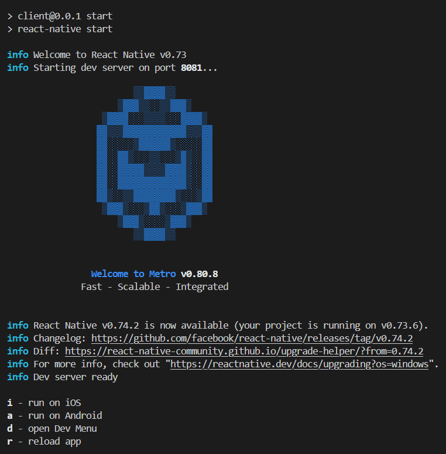

Đây là một dự án React Native dành cho điện thoại Android, là frontend của dự án Image Captioning.

# Chuẩn bị

## Chuẩn bị môi trường:

Hoàn thành bước chuẩn bị môi trường cho các dự án React Native, dựa vào trang [React Native - Cài đặt môi trường](https://reactnative.dev/docs/environment-setup). Điều này bao gồm:

- Node, môi trường chính.

- Thư viện React Native.

- JDK - Java Development Kit.

- Android Studio.

- (macOS) Watchman.

Các bước cài đặt chi tiết vui lòng xem trang cài đặt.

## Chuẩn bị mã nguồn:

Mã nguồn có thể lấy được từ git thông qua lệnh.

```
git clone https://github.com/YumeAyasaki/image_captioning.git
cd client
```

Cài đặt các thư viện cần thiết bằng

```
npm install
```

# Chạy mã nguồn

## Chuẩn bị
- Kiểm tra lại file môi trường ``.env``. Bởi vì thông thường, các thiết bị android chạy được xem là thiết bị riêng biệt so với thiết bị chạy máy nên việc sử dụng ngrok là được khuyên nhủ. Vì vậy, việc cập nhật đường dẫn server mới vào ``.env`` là cần thiết.
Người dùng cũng có thể cập nhật trong ứng dụng (Xem thêm: Mục 4. Hướng dẫn sử dụng, phần a. Ứng dụng React Native), tuy nhiên điều này có khả năng sẽ gây ra lỗi.

- Đảm bảo rằng máy tính/laptop đã nhận được thiết bị bằng công cụ adb. Việc kiểm tra có thể thực hiện dễ dàng bằng dòng lệnh
```
adb devices
```

## Chế độ gỡ lỗi
Khởi động một server Metro bằng dòng lệnh.
```
npm run start
```

Đảm bảo rằng server đã được khởi động hoàn tất, thể hiện bằng các command của server.



Tạo một terminal mới, khởi động việc build ứng dụng bằng
```
npm run android
```

hoặc build nhanh hơn, trong trường hợp người dùng có nhu cầu sử dụng hoặc khởi động lại ứng dụng nhiều lần.

```
npm run android-fast
```

## Chế độ đóng gói

Việc đóng gói một ứng dụng có thể không cần thiết trong việc thiết kế ứng dụng, nhưng để một ứng dụng có thể thương mại được thì việc đóng gói là cần thiết.

Để đóng gói, người dùng có thể đi đến trang [Phát hành lên Google Play Store](https://reactnative.dev/docs/signed-apk-android) hoặc [Cách để tạo sinh một phiên bản .apk của một ứng dụng React Native cho Android - instamobile](https://instamobile.io/android-development/generate-react-native-release-build-android/).